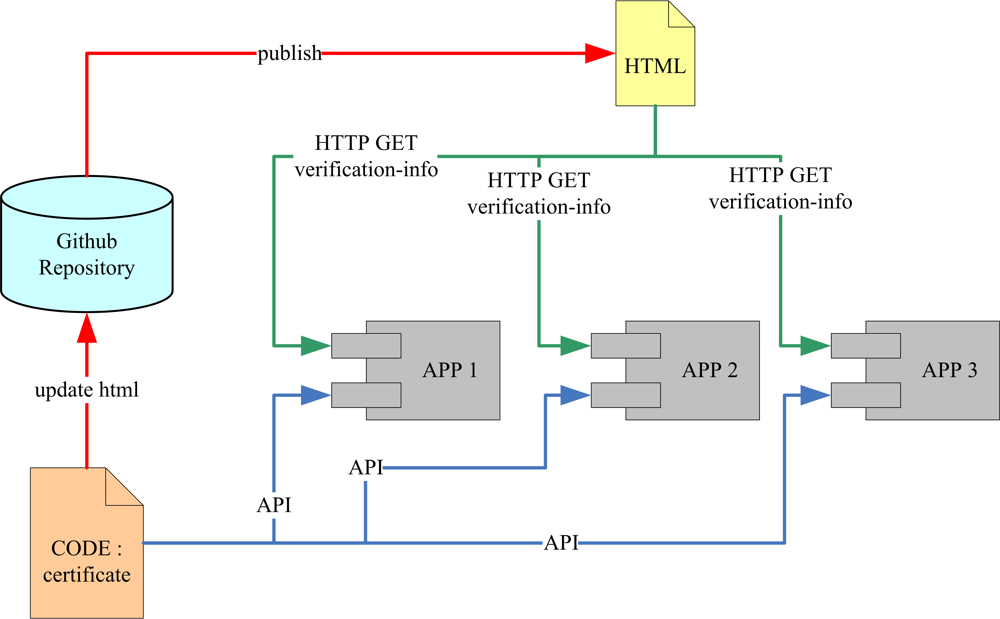
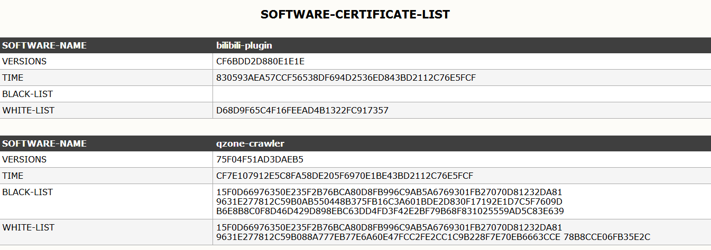

# software-certificate

> <b>软件授权清单&nbsp;:&nbsp;</b>[[ Management-Page ]](https://lyy289065406.github.io/software-certificate/)

------

## 运行环境


 


## 插件介绍

此插件是供开发者使用的，通过它可以利用 Github 服务器发布若干个应用的授权信息。

然后这些应用可以通过 Github 服务器提取自身的授权信息完成自检。

目前**提供的自检方案**主要有：

- 有效版本校验
- 有效时间校验
- 黑名单校验
- 白名单校验


## 实现原理




在 Github 的每个 Repository 都是可以发布一个静态页面的，而且这个静态页面可以在公网访问。

这个静态页面初衷是用来介绍 Repository 的，但是也可以利用它作为一个静态服务页，实现其他功能。


> **为某个 Repository 发布静态页面的方法：**
<br/>　　（1） 打开这个 Repository 的仓库首页
<br/>　　（2） 进入 `Settings` 页面
<br/>　　（3） 找到 `GitHub Pages`，在 `Source`下面有一个下拉框， 默认是 `None`， 修改为 `master branch`
<br/>　　（4） 然后刷新 `Settings` 页面，在 `GitHub Pages` 的位置会提示：Your site is published at `xxx-url`
<br/>　　（5） 在Repository根目录新建一个 `index.html` 文件，写入页面内容，就可以通过这个 `xxx-url` 访问它了


回到这个插件，其实原理就很简单了，要实现的功能主要有两个：

- （在开发环境）通过更新 `index.html`，在 `xxx-url` 静态页面维护被授权应用的信息
- （在生产环境）应用从 `xxx-url` 静态页面提取自身的授权信息进行自检


## 使用方式

由于插件存在两部分功能，因此使用方式也是对应拆分为两部分。

<br/>　**（开发环境）在 `xxx-url` 静态页面维护被授权应用的信息：**

1. 通过 git 命令 clone 这个插件仓库到本地
2. 修改 `./conf/ec_conf.xml` 配置文件，在节点 `<appInfos>` 下配置被授权的应用信息，格式为：

```xml
<!-- 具体的值根据实际需要去配置即可 -->
<appInfo>
  <name caption="应用名称">xxx</name>
  <versions caption="有效版本列表">xxx</versions>
  <time caption="到期时间">xxx</time>
  <blacklist caption="黑名单列表">xxx</blacklist>
  <whitelist caption="白名单列表">xxx</whitelist>
</appInfo>
```

3. 运行 `exp.certificate.Main` 类，会自动根据 `./conf/ec_conf.xml` 配置文件的内容刷新 `./index.html` 文件
4. 通过 git 提交变更，即成功把被授权应用的信息提交到了 Github服务器
5. 此时刷新静态页面地址 `xxx-url`，会发现页面内容已变更（**为了保证信息安全，所生成的授权信息均已加密处理**），如：



<br/>　**（生产环境）应用从 `xxx-url` 静态页面提取自身的授权信息进行自检：**

1. 通过 `maven install` 命令发布本插件作为 jar 构件，目标应用通过 pom.xml 依赖此构件：

```xml
<dependency>
    <groupId>com.exp-blog</groupId>
    <artifactId>software-certificate</artifactId>
    <version>${LATEST_VERSION}</version>
</dependency>
```

2. 构件内提供了 API：`exp.certificate.api.Certificate.getAppInfo()` ，可据此从 `xxx-url` 获取自身的授权信息
3. 获取到的授权信息会以明文方式保存到 `exp.certificate.bean.AppInfo`， 按需使用即可

